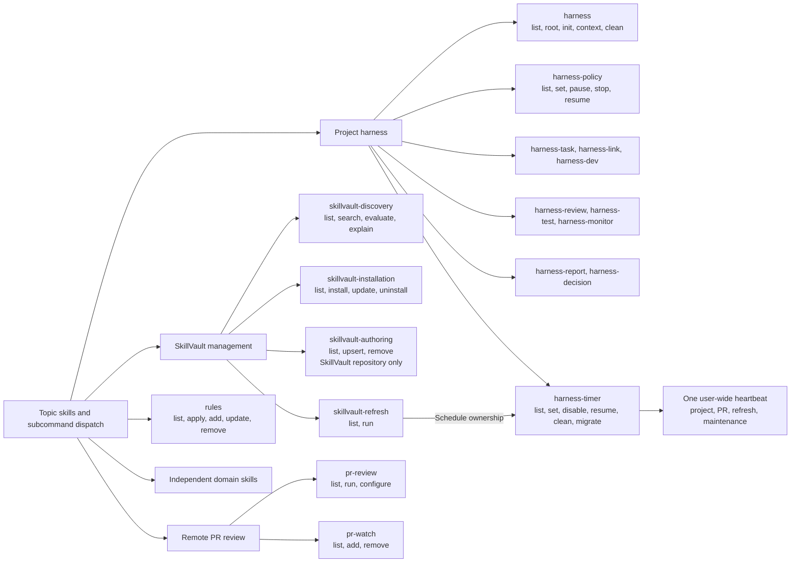
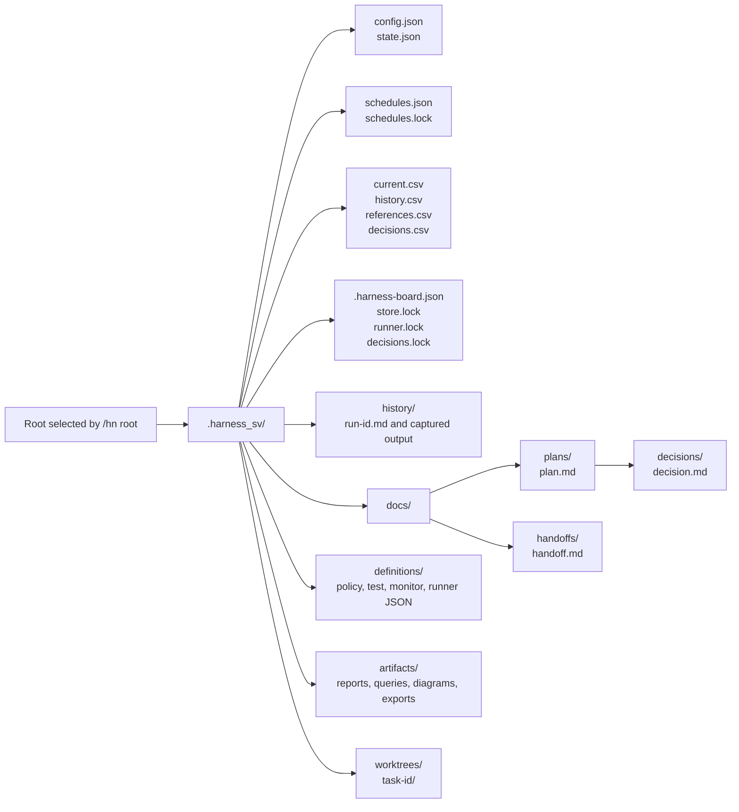

# Topic Skill Refactor

- Date: 2026-09-16
- Status: Source topic, transactional update, and compatibility contracts implemented; targeted management-copy rollout completed; subsequent installed-copy rollout remains separate
- Scope: Topic actions and synopsis hints, namespaced storage and explicit relocation, shared scheduling, retention, discovery, and evaluation records.

Use one registered skill per topic. Its first argument selects a subcommand; natural-language
requests can select the same operation. Bare multi-action topics use read-only `list`, including
`/harness-timer`. Descriptions and argument hints advertise primary actions, not aliases or modes;
they do not create nested VS Code autocomplete.

The [interface and baseline ADR](./decisions/2026-09-24-recovery-compatibility-and-harness-baseline-adr.md)
adds explicit executable-dependency interface checks. Its archive policy is superseded by the
[current-copy-only ADR](./decisions/2026-09-25-current-copy-only-installation-adr.md): temporary
originals protect in-progress updates, but success or verified rollback leaves no retained
installation archives. Removing existing obsolete copies remains explicitly scoped work.

The [accepted action-prefix ADR](./decisions/2026-09-23-topic-action-prefix-matching-adr.md)
adds conversational routing across these topics: exact actions and documented aliases win first;
otherwise exactly 3 or 4 leading letters select a unique canonical action within the selected topic.
Multiple matches require a choice; no match shows help; neither executes an action. Other arguments,
case handling, natural-language routing, full menus, and existing permissions/confirmations are
unchanged. PowerShell argument parsing and installed copies are not changed by this source update.

The command synopsis is `/harness-<topic> [action1|action2|...] [<arguments>...]`.
The top-level `/harness [list|root|init|context|clean]` is the agreed project entrypoint;
there is no `management` topic and actions do not become separate registered skills.

Harness topics register as `/harness` and `/harness-*` with matching folders and dependencies.
`/hn-*` is only conversational shorthand for quick typing, and `/hn` selects `/harness`.
For example, `/hn root` selects `/harness root`. No separate alias bundles are
registered or installed. SkillVault management registers the full `skillvault-*` names;
`/sv-*` is conversational shorthand only. The slash picker uses the full canonical names.

Skill authoring registers as `/skillvault-authoring [list|upsert|remove] [<arguments>...]`, with
`/sv-authoring` shorthand. The name describes creating and maintaining skill bundles, not coding
context or data sources. `/skillvault-source` and `/sv-source` retain the same actions as text
compatibility routes; their former folders are not duplicate source registrations.

## Command Structure



The diagram shows logical command relationships, not nested directories. The heartbeat is
implemented but source changes do not register or migrate live tasks. The standalone
`schedule-manager` continues to administer explicitly selected Windows tasks outside the harness.

Task records, identity, and updates belong to `harness-task`; `harness-dev` runs and queues work,
reusing task intake for ad-hoc requests. `harness-timer` owns schedules and stale definitions.
Historical records/reports and retention settings belong to `/harness clean`; the Saturday
maintenance tick invokes that same cleanup implementation. Existing policies and retention
protections are unchanged, and no additional maintenance topic is introduced.

Source/report authoring advertises one `upsert` action, with `create` and `update` as aliases.
The [accepted work-contract ADR](./decisions/2026-09-18-upsert-and-harness-work-contracts-adr.md)
also records whole-repository Fresh review, workspace-based completion, normalized exact task
identity, and linked follow-ups for explicitly revised completed work. These source changes do
not refresh installed copies or change live schedules.

## Folder Layout

These are the refactored families on disk; other category folders retain their existing layout.
Each skill folder matches its registered name. Subcommands use bundled operation guides, not
another layer of skill folders. Duplicate shorthand and old action-per-skill source folders
are not retained.
The `public` directory level is removed; reusable scaffolds live separately in top-level
`templates/`. This source-only layout change does not move installed copies or live state.
See the [accepted source-layout ADR](./decisions/2026-09-23-source-layout-adr.md) for rationale,
compatibility costs, and the boundary around installed-copy updates.
The separately approved [management-copy rollout](./decisions/2026-09-23-source-layout-adr.md#approved-installed-copy-rollout)
updated four global and two current-workspace copies, including the global authoring rename.
It did not refresh other installed skills or change live schedules.
The accepted [shared-ownership contract](./decisions/2026-09-23-shared-ownership-adr.md) is a later
source change: it coordinates manual/scheduled checkout use and affected runtime updates.
Its installed-copy transition remains separately approved; earlier rollout evidence does not
prove that live copies participate in the new protocol.

```text
skills/
|-- core/
|   |-- rules/
|   |-- skillvault-authoring/
|   |-- skillvault-discovery/
|   |-- skillvault-installation/
|   `-- skillvault-refresh/
|-- github/
|   |-- github-issues/
|   |-- pr-review/
|   `-- pr-watch/
`-- planning/
  |-- brainstorming/
  |-- grilling/
  |-- handoff/
  |-- harness/
  |-- harness-decision/
  |-- harness-dev/
  |-- harness-link/
  |-- harness-monitor/
  |-- harness-policy/
  |-- harness-report/
  |-- harness-review/
  |-- harness-task/
  |-- harness-test/
  |-- harness-timer/
  `-- planning-with-files/
```

The approved `.github/skills/` and global installed copies remain separate from this source tree
and now use the canonical topic layout. Short and legacy command spellings remain text aliases.
Removed source script paths are not provided; callers must use the corresponding canonical folder while
keeping the executable filename. This cleanup does not retarget live schedules.

## Project Storage

`/harness root` (`/hn root`) shows the selected root; `/harness root <path>` selects it. The
harness workspace is **`<root>/.harness_sv/`**, not a visible `harness/` folder and not the installed
skill bundle. All harness-owned information and files default here unless the user explicitly
specifies another destination. The following is the complete default artifact hierarchy:



```text
<root>/
`-- .harness_sv/
  |-- config.json
  |-- state.json
  |-- schedules.json
  |-- schedules.lock
  |-- current.csv
  |-- history.csv
  |-- references.csv
  |-- decisions.csv
  |-- decisions.lock
  |-- .harness-board.json
  |-- store.lock
  |-- runner.lock
  |-- history/
  |   `-- <run-id>.md
  |-- docs/
  |   |-- plans/
  |   |   |-- <plan>.md
  |   |   `-- decisions/
  |   |       `-- <decision>.md
  |   `-- handoffs/
  |       `-- <handoff>.md
  |-- definitions/
  |   `-- <policy-test-monitor-or-runner>.json
  |-- artifacts/
  |   `-- <report-query-diagram-or-export>/
  `-- worktrees/
    `-- <task-id>/
```

Configuration and state are authoritative runtime data; CSVs are generated views except the
decision register, which its helper owns. `history/<run-id>.md` stores run summaries, test/review
evidence, errors, and available captured output. Separate logs, when requested, use `history/`
unless the user specifies another path; do not duplicate reports to fill a logs folder.
Documents, definitions, artifacts, and worktrees are created only by the corresponding
authorized operation. The diagram is not a request to create all folders during initialization.

Pass `.harness_sv` output destinations to delegated authoring skills explicitly. A user-selected
destination or existing saved configuration takes precedence; preserve existing data and
report any legacy paths instead of moving records or retargeting schedules automatically.
Application source, linked documents/repositories, installed skills, and existing host instruction
entrypoints remain separate. The user-wide PR/refresh controllers are not relocated by project `root`.
`loc` aliases `root`. A verified legacy SkillVault controller at `.harness` is reused in place
when `.harness_sv` is absent; unrelated `.harness` folders are not adopted.

`root <new-parent>` selects the valid new target, then asks whether to move an initialized
previous harness; no move flag is required. Move is the displayed default, including no answer.
Explicit answers or applicable user instructions take precedence; No or cancel leaves old data
in place. `/hn-root <path>` follows the same workflow. The new Root stays selected either way.
A failed move is reported without undoing selection.
Invalid targets do not change Root. Uninitialized sources and unchanged paths need no move prompt.
Yes or the unanswered Move default previews and applies relocation from the saved previous root to a parent with no destination controller,
retaining identity, queue/pause state, registered dirty worktrees, external board/code targets,
and logical schedule cadence. `executionRoot` retains the original implicit coding/test target.
Known structured paths are updated; authored text and snapshot evidence are preserved. Active
work, collisions, linked filesystem entries, and ambiguous scheduled contexts block the move.

Topic `argument-hint` fields now use compact command synopsis notation: literal actions/options,
`<value>`, `[optional]`, `a|b`, and `...`. Exact operation forms belong in the body, not a simulated
parser or a long list of positional choices. `/harness-decision` defaults to active open decisions
plus a one-line **Configuration When Needed** summary and source link. `list all` adds recent
decisions and the detailed configuration checklist; closed and exact-ID views omit configuration.
Explicit Open/Proposed records stay visible. Unselected setup becomes an open choice only when
requested or enabled work needs a human decision that saved settings, inheritance, and defaults
cannot resolve. The [bulletin contract](./2026-09-15-harness-command-and-record-contracts.md#decision-bulletin)
preserves existing actions, CSV statuses, and read-only behavior. Recent-result limits remain,
and exact-ID inspection covers any status. Installed-copy updates are separate.

## Scheduling and Retention

The [scheduler contract](../../skills/planning/harness-timer/references/scheduler.md)
owns one current-user heartbeat and project-local logical schedules. The central registry,
shared maintenance settings, and latest process receipt per job use `~/.copilot/skillvault/scheduler`.
No work schedule has an invented cadence; fixed and calendar duration units are `m/h/d/n/y`.
The [adaptive-heartbeat ADR](./decisions/2026-09-23-adaptive-heartbeat-adr.md) sets a `1d` routine
baseline, configurable through `set heartbeat <duration>` without changing job schedules. Faster
fixed job intervals shorten it, active workers retain a 30-minute cap, and earlier job/maintenance
deadlines still win. Already blocked overdue work uses the adaptive recheck instead of one-minute
polling. The heartbeat has no AI model; scheduled workers keep their own approved configuration.
Nonconflicting approved roots can run together; active/uncertain jobs and intersecting roots are
not overlapped. Source changes do not synchronize live tasks or refresh installed copies.

Maintenance defaults to Saturday 08:30-09:00 local only after explicitly enabled, skips active
work, and does not catch up outside that window. Machine wake and AI assistance are allowed when
necessary, not required for routine scripted cleanup. Permission alone changes no live task or
AI execution; any concrete use retains existing scope, budgets, denials, and cleanup approvals. Retain
90 days and 5,000 completed entries per harness by default; optional per-topic count is 1,000.
Count-only, age-only, and combined policies are supported. Required/pinned/linked evidence is
protected even if it exceeds limits. Prune authoritative records and owned files together.
Disable confirmed stale jobs before a 30-day grace; deleting legacy OS definitions requires
explicit approval and unchanged ownership. Existing OS timers need exact migration preview.

## Discovery and Evaluations

Supporting research honors an explicit source first; otherwise use local, configured accessible
internal, then authoritative external sources as needed. Working permissions and stricter source
resolvers are separate. Never leak private search terms or silently substitute for a failed target.

Discovery keeps the canonical `list|search|evaluate|explain` menu and read-only bare default.
`eval` and `expl` remain exact action aliases alongside the topic-local action-prefix rule above.
`explain` accepts skills, tools, and products: explain the requested subject first, then distinguish
any related skill. Ask only when the intended subject is genuinely ambiguous; an unavailable
explicit source remains a limitation, not permission to substitute another subject.

Evaluation separates standalone usefulness, the SkillVault guide decision, and harness integration
when relevant. Only the guide decision uses `upsert/defer/skip`; a candidate may be worth trying
standalone while integration is deferred. Recommendations authorize no execution or installation.
These source changes do not refresh installed copies; preview and approve those updates separately.

Completed public-safe evaluations use one `docs/evaluations/<candidate>.md` record per canonical
source, including defer/skip, with a chat-only opt-out. Reevaluate outdated evidence, not the
record's wording. Private assessments require a private destination. Records are outside history
cleanup and do not become catalog entries. The [Oh My Pi assessment](../evaluations/oh-my-pi.md)
records the completed research; installing OMP or integrating its runtime has not been validated.

## Catalog Mapping

Each pre-refactor skill appears once below. Independent specialists retain their scope and author
metadata; only the three named action-suffix aliases change. Reference-only limits remain on
Archify, Graphify, Humanizer, and Planning With Files, not on executable or authoring specialists.
New specialists map to their own canonical names without implying a previous installation.

| Former skill | Topic and action |
| --- | --- |
| archify | archify |
| architecture-decision-records | architecture-decision-records |
| brainstorming | brainstorming |
| differential-review | differential-review |
| github-issues | github-issues |
| graphify | graphify |
| grilling | grilling |
| handoff | handoff |
| harness-context | harness context |
| harness-decide | harness-decision |
| harness-dev | harness-dev |
| harness-fallback | harness-policy fallback |
| harness-init | harness init |
| harness-loc | harness loc |
| harness-monitor | harness-monitor |
| harness-ref | harness-link |
| harness-report-create | harness-report upsert |
| harness-restrict | harness-policy limits |
| harness-review | harness-review |
| harness-root | harness root |
| harness-task | harness-task |
| harness-test | harness-test |
| harness-timer | harness-timer set project |
| humanizer | humanizer |
| jarvis-metrics-create | jarvis-metrics |
| kpi-dashboard-design | kpi-dashboard |
| openapi-spec-generation | openapi-spec |
| planning-with-files | planning-with-files |
| powerbi-modeling | powerbi-modeling |
| pr-review | pr-review run |
| pr-review-add | pr-watch add |
| pr-review-list | pr-watch list |
| pr-review-remove | pr-watch remove |
| pr-review-timer | harness-timer set pr |
| rules | rules list, add, update, remove |
| rules-core | rules apply |
| schedule-manager | schedule-manager |
| skillvault-evaluate | skillvault-discovery evaluate |
| skillvault-fresh | skillvault-refresh run; harness-timer set refresh |
| skillvault-install | skillvault-installation install, update |
| skillvault-key-points | skillvault-discovery explain |
| skillvault-list | skillvault-installation list |
| skillvault-remove | skillvault-authoring remove |
| skillvault-search | skillvault-discovery search |
| skillvault-uninstall | skillvault-installation uninstall |
| skillvault-upsert | skillvault-authoring upsert |
| supabase-postgres-best-practices | supabase-postgres-best-practices |
| trading-signal-analysis | trading-signal-analysis |
| webapp-testing | webapp-testing |

## Boundaries

- `/skillvault-authoring` authors skill bundles and catalog entries in a verified SkillVault repository,
  never the working project's application source. Show source, working project, and optional
  installation target separately. Preserve the source resolver's existing selection rules.
- `/rules apply` loads the compact rules without changing files. Add, modify, and remove use
  the authoritative rules document and retain explicit approval. Workers receive core guidance
  explicitly; installing or mentioning a skill is not automatic context injection.
- Grilling remains a human decision interview. Offer it for unresolved consequential choices,
  including choices found after development, not every review or monitor tick. Unattended
  workers report questions and defer dependent actions. Tests and independent reviews remain.
- Keep complete runtime bundles colocated in the selected installation scope. Source contains
  only the canonical topic folders, not duplicate shorthand wrappers. Old conversational
  commands route to the matching action without broadening its authority.
- Preserve controller roots, repository references, board/state/report paths, permissions,
  snapshot checks, review independence, time and credit limits, and existing timer cadences.
- Default new harness-owned artifacts to `.harness_sv` inside the selected root; preserve explicit
  output paths and existing records. Never turn location selection into a storage migration.
- Source changes do not refresh installed copies, initialize controllers, migrate live timers,
  change PACS schedules, clone repositories, commit, push, or publish. Exact rollout is separate.

## Verification

Validate topic metadata, exact catalog coverage, resource links, explicit subcommand routes,
bootstrap selection, canonical folders and conversational shortcuts, and affected runtime fixtures.
Use focused checks while editing, then one complete suite for this shared-runtime change. Installed-copy
replacement and live scheduler activation require separate parity/OS checks; do not infer them from fixtures.

### Current Result

On 2026-09-23, the separately approved source-only cleanup retired the uncataloged
`jarvis-metrics-create` duplicate after verifying an external recovery copy of both original files.
The canonical `jarvis-metrics` guide already preserves the workflow and legacy command spelling;
no content merge or catalog change was needed. The historical scope-audit link now targets that
guide without changing its original label or assessment.

The full [regression suite](../../scripts/test-all.ps1) passed: all 23 Node contracts, every
PowerShell/Bash fixture group, catalog validation for 35 skills, resource validation for 30
project-installed copies, and `git diff --check`. Installed copies, live schedules, Git staging,
and publication were unchanged. The earlier Jarvis catalog blocker is resolved.

### Earlier Results

The following results are retained as history, not current validation blockers.

The repository gate includes 19 Node contracts, namespace/legacy-controller fixtures, retention,
duration/scheduler/migration fixtures, existing runtime and installer checks, catalog validation,
and whitespace validation. Fixtures use fake workers/tasks and temporary controllers, not live AI
or schedules. The source catalog contains 35 skills with no duplicate alias skill bundles.

The obsolete harness directories identified by the naming contract have been backed up and
removed through editor-aware file deletion. Focused checks pass for canonical-only names,
command synopsis enums, history cleanup through the public harness command, schedule-only timer
cleanup, and weekly delegation to the shared retention engine. The full source gate passed all
19 Node contracts and every PowerShell/Bash fixture group, then stopped on the existing
uncataloged `jarvis-metrics-create` bundle. That bundle remains outside the approved harness
cleanup; a complete repository pass is not claimed. YAML/JSON/resource checks passed for all
35 cataloged public and 30 project-installed skills. No live AI credential validation is implied.

The accepted upsert/review/task refinements passed the same 19 contracts and all fixture groups.
Coverage includes meaning-preserving task matching, idempotent linked follow-ups, preserved
completion evidence, ancestor retention, shared-workspace relocation, and Fresh versus ordinary
Review/Critical scope. The full gate still stops only at the existing uncataloged Jarvis bundle.

The authoring rename passed all 19 Node contracts and every PowerShell/Bash fixture group,
including the renamed source helpers and migration of both former authoring names with backup.
YAML/JSON/resource validation passed for 35 public and 30 project-installed skills. Full catalog
coverage still reports the same uncataloged Jarvis bundle; this rename did not remove it.

## Rollout Status

The approved installation set remains 14 global topics and 30 current-project copies. Management
topics in that rollout register as `skillvault-discovery`, `skillvault-installation`, `skillvault-refresh`, and
the former `skillvault-source`, with `sv-*` only as conversational shortcuts. The naming correction updated
7 global and 5 project copies, including affected dependencies, and retired 6 short-name
registrations after backup. Excluded `.skillvault-backup-migration-*` directories are retained
under both installation roots. The subsequent history-ownership update refreshed only the existing
global/project `harness` and `harness-timer` copies plus project `harness-task` and `harness-dev`.
Those six copies matched source content and metadata at version `1.0.0` at that rollout; no missing
global topic was installed. The later accepted upsert/review/task changes are source-only and have
not been refreshed into installed copies. The unrelated installed Jarvis difference is preserved.
Unmanaged copies and other projects are untouched.

The accepted `skillvault-authoring` rename is now implemented in source, including former-name
compatibility and a tested installed-copy migration mapping. The earlier upsert, whole-repository
Fresh review, workspace completion, normalized task identity, linked follow-ups, and reviewer-only
continuation decisions are also implemented in source. Installed-copy migration remains separate;
do not infer activation from these changes. Project-specific settings and deferred runtime adoption
are not missing implementations of an accepted reusable contract.

A read-only rollout preview selected four global copies (`harness`, `skillvault-authoring`,
`skillvault-discovery`, `skillvault-installation`) and six current-project copies (`harness`,
`harness-dev`, `harness-report`, `harness-review`, `harness-task`, `skillvault-installation`).
It would back up and retire the former global `skillvault-source`. No explicit approval was
provided for that exact replacement set, so installed copies remain unchanged. The earlier
conditional staging request was blocked by full catalog validation at that time; nothing was
staged in that run. The current cleanup does not authorize staging or publication.

Saturday maintenance is enabled for 08:30-09:00 in the saved Eastern Standard Time zone,
including its daylight-saving rules. The single owned heartbeat uses current-user Interactive
logon, Limited privilege, weekly maintenance-only cadence, and no machine wake. Actual task
settings were verified; pre-existing task definitions are unchanged. There are no registered
project, PR, or refresh work jobs, and no cleanup was run during rollout. No legacy SkillVault
OS task needed migration.

After the history-ownership refresh, the live scheduler JSON and exact SkillVault/PACS task
definitions still matched their pre-refresh snapshots. All 13 approved obsolete source directories
remained absent, with their 25-file recovery copy retained outside skill discovery; see the
[recovery outcome](../../review/harness-layout-recovery-2026-09-18.md#recovery-applied).

No live root destination was supplied: the selected project remains uninitialized and unmoved.
Oh My Pi remains deferred; project-specific models, permissions, work schedules, and monitoring
targets are not invented. Source changes remain uncommitted and unpublished.