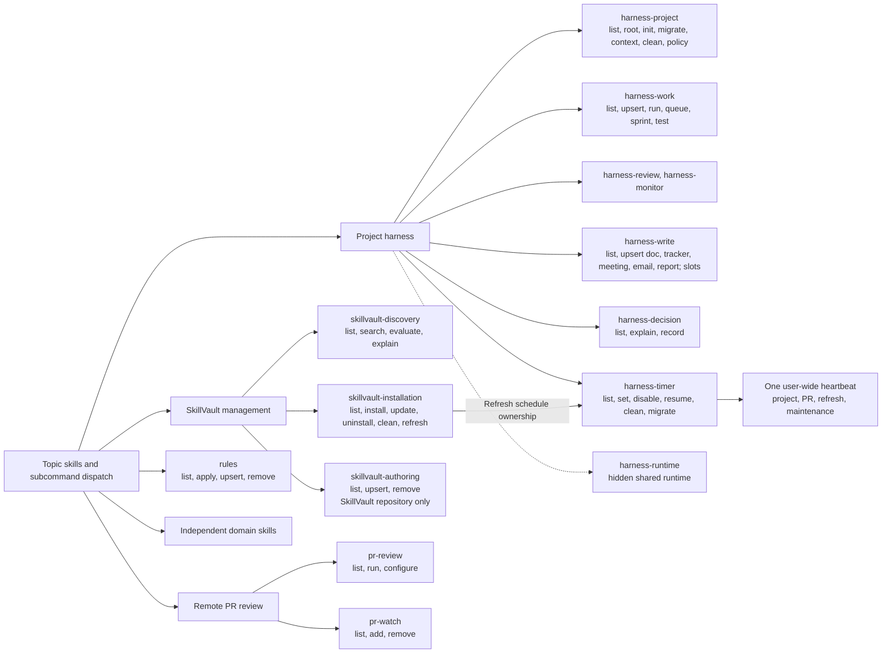
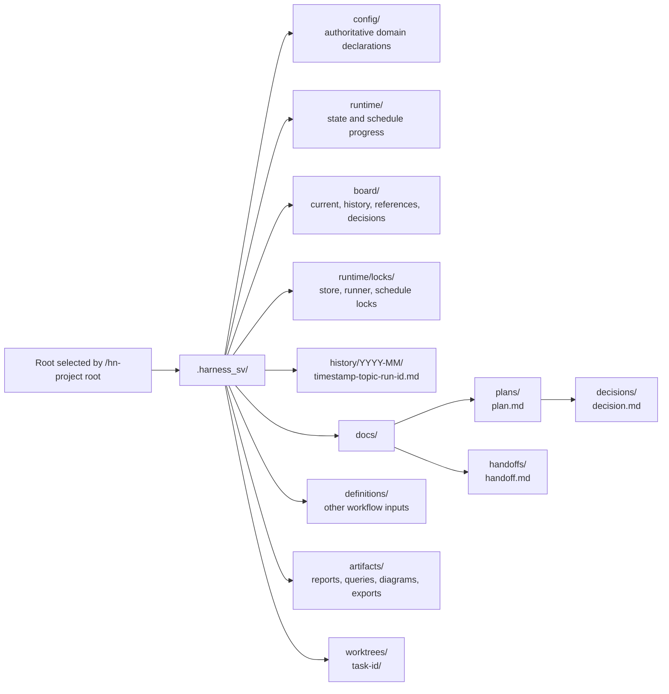

# Topic Skill Refactor

- Date: 2026-09-16
- Status: Source topic, transactional update, and compatibility contracts implemented; targeted management-copy rollout completed; subsequent installed-copy rollout remains separate
- Scope: Topic actions and synopsis hints, namespaced storage and explicit relocation, shared scheduling, retention, discovery, and evaluation records.

Use one registered skill per topic. Its first argument selects a subcommand; natural-language
requests can select the same operation. Bare multi-action topics use read-only `list`, including
`/harness-timer`. Descriptions and argument hints advertise primary actions, not aliases or modes;
they do not create nested VS Code autocomplete.

The [interface and baseline ADR](./decisions/2026-09-24-recovery-compatibility-and-harness-baseline-adr.md)
adds explicit executable-dependency interface checks. Its archive policy is superseded by the
[current-copy-only ADR](./decisions/2026-09-25-current-copy-only-installation-adr.md): temporary
originals protect in-progress updates, but success or verified rollback leaves no retained
installation archives. Removing existing obsolete copies remains explicitly scoped work.

The [accepted action-prefix ADR](./decisions/2026-09-23-topic-action-prefix-matching-adr.md)
adds conversational routing across these topics: exact actions and documented aliases win first;
otherwise exactly 3 or 4 leading letters select a unique canonical action within the selected topic.
Multiple matches require a choice; no match shows help; neither executes an action. Other arguments,
case handling, natural-language routing, full menus, and existing permissions/confirmations are
unchanged. PowerShell argument parsing and installed copies are not changed by this source update.

The command synopsis is `/harness-<topic> [action1|action2|...] [<arguments>...]`.
The project entrypoint is `/harness-project [list|root|init|migrate|context|clean|policy]`;
there is no `management` topic and actions do not become separate registered skills. On 2026-10-07
the thirteen harness topics were consolidated into seven; see the
[topic consolidation ADR](./decisions/2026-10-07-harness-topic-consolidation-adr.md).

Harness topics register as `/harness-*` with matching folders and dependencies: `harness-project`,
`harness-work`, `harness-write`, `harness-review`, `harness-decision`, `harness-monitor`, and
`harness-timer`. The shared `harness-runtime` bundle is hidden from the `/` menu.
`/hn-*` is only conversational shorthand for quick typing; for example, `/hn-project root` selects
`/harness-project root`. Retired topic and command names are not accepted; see the
[old-name retirement ADR](./decisions/2026-10-07-retire-old-names-adr.md). No separate alias bundles are
registered or installed. SkillVault management registers the full `skillvault-*` names:
`skillvault-discovery`, `skillvault-installation`, and `skillvault-authoring`. `/sv-<topic>` is
conversational shorthand only. The slash picker uses the full canonical names. Refresh is the
`/skillvault-installation refresh` action; see the
[SkillVault topic consolidation ADR](./decisions/2026-10-07-skillvault-topic-consolidation-adr.md).

Skill authoring registers as `/skillvault-authoring [list|upsert|remove] [<arguments>...]`, with
`/sv-authoring` shorthand. The name describes creating and maintaining skill bundles, not coding
context or data sources.

## Command Structure


```mermaid
flowchart LR
    ENTRY["Topic skills and subcommand dispatch"]
    ENTRY --> SV["SkillVault management"]
    ENTRY --> HN["Project harness"]
    ENTRY --> PR["Remote PR review"]
    ENTRY --> RULES["rules<br/>list, apply, upsert, remove"]
    ENTRY --> DOMAIN["Independent domain skills"]
    SV --> DISCOVER["skillvault-discovery<br/>list, search, evaluate, explain"]
    SV --> INSTALL["skillvault-installation<br/>list, install, update, uninstall, clean, refresh"]
    SV --> AUTHORING["skillvault-authoring<br/>list, upsert, remove<br/>SkillVault repository only"]
    HN --> PROJECT["harness-project<br/>list, root, init, migrate, context, clean, policy"]
    HN --> WORK["harness-work<br/>list, upsert, run, queue, sprint, test"]
    HN --> CHECK["harness-review, harness-monitor"]
    HN --> OUTPUT["harness-write<br/>list, upsert doc, tracker, meeting, email, report; slots"]
    HN --> DECIDE["harness-decision<br/>list, explain, record"]
    HN --> TIMER["harness-timer<br/>list, set, disable, resume, clean, migrate"]
    HN -.-> RUNTIME["harness-runtime<br/>hidden shared runtime"]
    PR --> REVIEW["pr-review<br/>list, run, configure"]
    PR --> WATCH["pr-watch<br/>list, add, remove"]
    TIMER --> HEARTBEAT["One user-wide heartbeat<br/>project, PR, refresh, maintenance"]
    INSTALL -->|Refresh schedule ownership| TIMER
```

The diagram shows logical command relationships, not nested directories. The heartbeat is
implemented but source changes do not register or migrate live tasks. The standalone
`schedule-manager` continues to administer explicitly selected Windows tasks outside the harness.

Task records, identity, and updates belong to `harness-work upsert`; `harness-work run|queue` runs
and queues work, reusing task intake for ad-hoc requests, and `harness-work sprint` runs goal-based
sprints over existing tasks without a second task store. `harness-timer` owns schedules and stale definitions.
Historical records/reports and retention settings belong to `/harness-project clean`; the Saturday
maintenance tick invokes that same cleanup implementation. Existing policies and retention
protections are unchanged, and no additional maintenance topic is introduced.

Source, report, and documentation authoring advertise one `upsert` action, with `create` and `update` as aliases.
The [accepted work-contract ADR](./decisions/2026-09-18-upsert-and-harness-work-contracts-adr.md)
also records whole-repository Fresh review, workspace-based completion, normalized exact task
identity, and linked follow-ups for explicitly revised completed work. These source changes do
not refresh installed copies or change live schedules.

`harness-write upsert doc` provides session-level feature guides, onboarding, and troubleshooting. It uses
existing approved task context when applicable and does not require initialization or add a
`harness.ps1` action. Humanizer edits prose before final validation; decision history remains
with `architecture-decision-records`. See the
[accepted documentation ADR](./decisions/2026-09-26-harness-documentation-adr.md).

`harness-write upsert tracker|meeting|email` drafts stakeholder trackers, meeting invites, and email
updates or thread replies in the session, and `harness-write slots` ranks meeting times from saved
free/busy data. It likewise needs no initialization or `harness.ps1` action, and it saves drafts
only; sending, inviting, and sharing need explicit requests. See the
[accepted communications ADR](./decisions/2026-09-29-harness-communications-adr.md).

## Folder Layout

These are the refactored families on disk; other category folders retain their existing layout.
Each skill folder matches its registered name. Subcommands use bundled operation guides, not
another layer of skill folders. Duplicate shorthand and old action-per-skill source folders
are not retained.
The `public` directory level is removed; reusable scaffolds live separately in top-level
`templates/`. This source-only layout change does not move installed copies or live state.
See the [accepted source-layout ADR](./decisions/2026-09-23-source-layout-adr.md) for rationale,
compatibility costs, and the boundary around installed-copy updates.
The separately approved [management-copy rollout](./decisions/2026-09-23-source-layout-adr.md#approved-installed-copy-rollout)
updated four global and two current-workspace copies, including the global authoring rename.
It did not refresh other installed skills or change live schedules.
The accepted [shared-ownership contract](./decisions/2026-09-23-shared-ownership-adr.md) is a later
source change: it coordinates manual/scheduled checkout use and affected runtime updates.
Its installed-copy transition remains separately approved; earlier rollout evidence does not
prove that live copies participate in the new protocol.

```text
skills/
|-- core/
|   |-- rules/
|   |-- skillvault-authoring/
|   |-- skillvault-discovery/
|   `-- skillvault-installation/
|-- github/
|   |-- github-issues/
|   |-- pr-publish/
|   |-- pr-review/
|   `-- pr-watch/
`-- planning/
  |-- brainstorming/
  |-- grilling/
  |-- handoff/
  |-- harness-decision/
  |-- harness-monitor/
  |-- harness-project/
  |-- harness-review/
  |-- harness-runtime/
  |-- harness-timer/
  |-- harness-work/
  |-- harness-write/
  `-- planning-with-files/
```

The approved `.github/skills/` and global installed copies remain separate from this source tree
and now use the canonical topic layout. Short and legacy command spellings remain text aliases.
Removed source script paths are not provided; callers must use the corresponding canonical folder while
keeping the executable filename. This cleanup does not retarget live schedules.

## Project Storage

`/harness-project root` (`/hn-project root`) shows the selected root; `/harness-project root <path>` selects it. The
harness workspace is **`<root>/.harness_sv/`**, not a visible `harness/` folder and not the installed
skill bundle. All harness-owned information and files default here unless the user explicitly
specifies another destination. The following is the complete default artifact hierarchy:


```mermaid
flowchart LR
  ROOT["Root selected by /hn-project root"] --> STORE[".harness_sv/"]
  STORE --> CONFIG["config/<br/>authoritative domain declarations"]
  STORE --> STATE["runtime/<br/>state and schedule progress"]
  STORE --> BOARD["board/<br/>current, history, references, decisions"]
  STORE --> LOCKS["runtime/locks/<br/>store, runner, schedule locks"]
  STORE --> HISTORY["history/YYYY-MM/<br/>timestamp-topic-run-id.md"]
  STORE --> DOCS["docs/"]
  DOCS --> PLANS["plans/<br/>plan.md"]
  PLANS --> DECISIONS["decisions/<br/>decision.md"]
  DOCS --> HANDOFFS["handoffs/<br/>handoff.md"]
  STORE --> DEFINITIONS["definitions/<br/>other workflow inputs"]
  STORE --> ARTIFACTS["artifacts/<br/>reports, queries, diagrams, exports"]
  STORE --> WORKTREES["worktrees/<br/>task-id/"]
```

```text
<root>/
`-- .harness_sv/
  |-- README.md
  |-- config/
  |   |-- project.json
  |   |-- monitors.json
  |   |-- tests.json
  |   |-- policy.json
  |   `-- schedules.json
  |-- board/
  |   |-- current-<project>.csv
  |   |-- history.csv
  |   |-- references.csv
  |   |-- decisions.csv
  |   |-- decisions.lock
  |   `-- .harness-board.json
  |-- runtime/
  |   |-- state.json
  |   |-- schedules.json
  |   `-- locks/
  |-- history/
  |   `-- YYYY-MM/
  |       `-- <UTC-timestamp>-<topic>-<run-id>.md
  |-- docs/
  |   |-- plans/
  |   |   |-- <plan>.md
  |   |   `-- decisions/
  |   |       `-- <decision>.md
  |   `-- handoffs/
  |       `-- <handoff>.md
  |-- definitions/
  |-- adapters/
  |-- observations/
  |-- artifacts/
  |   `-- <report-query-diagram-or-export>/
  `-- worktrees/
    `-- <task-id>/
```

Configuration domains are the single editable authority; effective settings are combined only
in memory. Runtime state is separate. CSVs are generated views except the decision register,
which its helper owns. Monthly history files store run summaries, test/review
evidence, errors, and available captured output. Separate logs, when requested, use `history/`
unless the user specifies another path; do not duplicate reports to fill a logs folder.
Documents, definitions, artifacts, and worktrees are created only by the corresponding
authorized operation. The diagram is not a request to create all folders during initialization.

Pass `.harness_sv` output destinations to delegated authoring skills explicitly. A user-selected
destination or existing saved configuration takes precedence; preserve existing data and
report any legacy paths instead of moving records or retargeting schedules automatically.
Reader-facing `harness-write` doc output follows the selected coding repository's documentation
convention, or explicit output path, rather than this runtime hierarchy. Pass that destination
explicitly when delegating documentation; any existing harness tracking remains controller-local.
Application source, linked documents/repositories, installed skills, and existing host instruction
entrypoints remain separate. The user-wide PR/refresh controllers are not relocated by project `root`.
`loc` aliases `root`. A verified legacy SkillVault controller at `.harness` is reused in place
when `.harness_sv` is absent; unrelated `.harness` folders are not adopted.

New controllers use this layout. `/hn-project migrate` previews and, after approval, converts an existing
controller in place, preserving IDs, report contents, queues, and cadence while updating owned links.
`init` never silently migrates. See the [accepted decision](./decisions/2026-09-25-declarative-harness-and-auto-verification-adr.md).
Existing standalone decision registers retain their board location during first initialization.
The [accepted naming ADR](./decisions/2026-09-25-project-qualified-board-names-adr.md) records the
project-qualified default, central `currentFileName` setting, legacy fallback, and guarded explicit
renames. Topic-filtered CSVs are requested artifact snapshots, never extra canonical boards.

`root <new-parent>` selects the valid new target, then asks whether to move an initialized
previous harness; no move flag is required. Move is the displayed default, including no answer.
Explicit answers or applicable user instructions take precedence; No or cancel leaves old data
in place. `/hn-project root <path>` follows the same workflow. The new Root stays selected either way.
A failed move is reported without undoing selection.
Invalid targets do not change Root. Uninitialized sources and unchanged paths need no move prompt.
Yes or the unanswered Move default previews and applies relocation from the saved previous root to a parent with no destination controller,
retaining identity, queue/pause state, registered dirty worktrees, external board/code targets,
and logical schedule cadence. `executionRoot` retains the original implicit coding/test target.
Known structured paths are updated; authored text and snapshot evidence are preserved. Active
work, collisions, linked filesystem entries, and ambiguous scheduled contexts block the move.

Topic `argument-hint` fields now use compact command synopsis notation: literal actions/options,
`<value>`, `[optional]`, `a|b`, and `...`. Exact operation forms belong in the body, not a simulated
parser or a long list of positional choices. `/harness-decision` defaults to active open decisions
plus a one-line **Configuration When Needed** summary and source link. `list all` adds recent
decisions and the detailed configuration checklist; closed and exact-ID views omit configuration.
Explicit Open/Proposed records stay visible. Unselected setup becomes an open choice only when
requested or enabled work needs a human decision that saved settings, inheritance, and defaults
cannot resolve. The [bulletin contract](./2026-09-15-harness-command-and-record-contracts.md#decision-bulletin)
preserves existing actions, CSV statuses, and read-only behavior. Recent-result limits remain,
and exact-ID inspection covers any status. Installed-copy updates are separate.

## Scheduling and Retention

The [scheduler contract](../../skills/planning/harness-timer/references/scheduler.md)
owns one current-user heartbeat and project-local logical schedules. The central registry,
shared maintenance settings, and latest process receipt per job use `~/.copilot/skillvault/scheduler`.
No work schedule has an invented cadence; fixed and calendar duration units are `m/h/d/n/y`.
The [adaptive-heartbeat ADR](./decisions/2026-09-23-adaptive-heartbeat-adr.md) sets a `1d` routine
baseline, configurable through `set heartbeat <duration>` without changing job schedules. Faster
fixed job intervals shorten it, active workers retain a 30-minute cap, and earlier job/maintenance
deadlines still win. Already blocked overdue work uses the adaptive recheck instead of one-minute
polling. The heartbeat has no AI model; scheduled workers keep their own approved configuration.
Nonconflicting approved roots can run together; active/uncertain jobs and intersecting roots are
not overlapped. Source changes do not synchronize live tasks or refresh installed copies.

Maintenance defaults to Saturday 08:30-09:00 local only after explicitly enabled, skips active
work, and does not catch up outside that window. Machine wake and AI assistance are allowed when
necessary, not required for routine scripted cleanup. Permission alone changes no live task or
AI execution; any concrete use retains existing scope, budgets, denials, and cleanup approvals. Retain
90 days and 5,000 completed entries per harness by default; optional per-topic count is 1,000.
Count-only, age-only, and combined policies are supported. Required/pinned/linked evidence is
protected even if it exceeds limits. Prune authoritative records and owned files together.
Disable confirmed stale jobs before a 30-day grace; deleting legacy OS definitions requires
explicit approval and unchanged ownership. Existing OS timers need exact migration preview.

## Discovery and Evaluations

Supporting research honors an explicit source first; otherwise use local, configured accessible
internal, then authoritative external sources as needed. Working permissions and stricter source
resolvers are separate. Never leak private search terms or silently substitute for a failed target.

Discovery keeps the canonical `list|search|evaluate|explain` menu and read-only bare default.
`eval` and `expl` remain exact action aliases alongside the topic-local action-prefix rule above.
`explain` accepts skills, tools, and products: explain the requested subject first, then distinguish
any related skill. Ask only when the intended subject is genuinely ambiguous; an unavailable
explicit source remains a limitation, not permission to substitute another subject.

Evaluation separates standalone usefulness, the SkillVault guide decision, and harness integration
when relevant. Only the guide decision uses `upsert/defer/skip`; a candidate may be worth trying
standalone while integration is deferred. Recommendations authorize no execution or installation.
These source changes do not refresh installed copies; preview and approve those updates separately.

Completed public-safe evaluations use one `docs/evaluations/<candidate>.md` record per canonical
source, including defer/skip, with a chat-only opt-out. Reevaluate outdated evidence, not the
record's wording. Private assessments require a private destination. Records are outside history
cleanup and do not become catalog entries. The [Oh My Pi assessment](../evaluations/oh-my-pi.md)
records the completed research; installing OMP or integrating its runtime has not been validated.

## Catalog Mapping

Every catalog skill registers under its own canonical name, and each topic folder registers one
topic. The [harness topic consolidation ADR](./decisions/2026-10-07-harness-topic-consolidation-adr.md)
and the [SkillVault topic consolidation ADR](./decisions/2026-10-07-skillvault-topic-consolidation-adr.md)
record which retired topics the current topics and actions replaced. The installer's former-name
map retires installed copies under those names; nothing else accepts them.

| Skill | Command and actions |
| --- | --- |
| archify | archify |
| architecture-decision-records | architecture-decision-records |
| awesome-gamedev-agent-skills | awesome-gamedev-agent-skills |
| brainstorming | brainstorming |
| differential-review | differential-review |
| dri | dri list, investigate |
| github-issues | github-issues |
| graphify | graphify |
| grilling | grilling |
| handoff | handoff |
| harness-decision | harness-decision list, explain, record |
| harness-monitor | harness-monitor list, declare, check, accept, auto |
| harness-project | harness-project list, root, init, migrate, context, clean, policy |
| harness-review | harness-review list, run |
| harness-timer | harness-timer list, set, disable, resume, clean, migrate |
| harness-work | harness-work list, upsert, run, queue, sprint, test |
| harness-write | harness-write list, upsert, slots |
| humanizer | humanizer |
| humanizer-ch | humanizer-ch |
| jarvis-metrics | jarvis-metrics |
| kpi-dashboard | kpi-dashboard |
| office-documents | office-documents |
| openapi-spec | openapi-spec |
| planning-with-files | planning-with-files |
| powerbi-modeling | powerbi-modeling |
| ppt-master | ppt-master |
| pr-publish | pr-publish list, preview, upsert |
| pr-review | pr-review list, run, configure |
| pr-watch | pr-watch list, add, remove |
| rag-implementation | rag-implementation |
| rules | rules list, apply, upsert, remove |
| schedule-manager | schedule-manager list, enable, disable, delete |
| skillvault-authoring | skillvault-authoring list, upsert, remove |
| skillvault-discovery | skillvault-discovery list, search, evaluate, explain |
| skillvault-installation | skillvault-installation list, install, update, uninstall, clean, refresh |
| supabase-postgres-best-practices | supabase-postgres-best-practices |
| trading-signal-analysis | trading-signal-analysis |
| webapp-testing | webapp-testing |

## Boundaries

- `/skillvault-authoring` authors skill bundles and catalog entries in a verified SkillVault repository,
  never the working project's application source. Show source and working project separately;
  upsert never installs. Preserve the source resolver's existing selection rules.
- `/rules apply` loads the compact rules without changing files. Upsert and remove change private
  Personal rules by default and the shared core only on request, always after explicit approval;
  `/rules` keeps a generated always-on copy of the four rules. Workers receive core guidance
  explicitly; installing or mentioning a skill is not automatic context injection.
- Grilling remains a human decision interview. Offer it for unresolved consequential choices,
  including choices found after development, not every review or monitor tick. Unattended
  workers report questions and defer dependent actions. Tests and independent reviews remain.
- Keep complete runtime bundles colocated in the selected installation scope. Source contains
  only the canonical topic folders, not duplicate shorthand wrappers. Retired topic and command
  names are not routes; installed-copy migration retires copies under former names.
- Preserve controller roots, repository references, board/state/report paths, permissions,
  snapshot checks, review independence, time and credit limits, and existing timer cadences.
- Default new harness-owned artifacts to `.harness_sv` inside the selected root; preserve explicit
  output paths and existing records. Never turn location selection into a storage migration.
- Source changes do not refresh installed copies, initialize controllers, migrate live timers,
  change PACS schedules, clone repositories, commit, push, or publish. Exact rollout is separate.

## Verification

Validate topic metadata, exact catalog coverage, resource links, explicit subcommand routes,
bootstrap selection, canonical folders and conversational shortcuts, and affected runtime fixtures.
Use focused checks while editing, then one complete suite for this shared-runtime change. Installed-copy
replacement and live scheduler activation require separate parity/OS checks; do not infer them from fixtures.

## Rollout Status

Managed global and current-project copies are updated through `/skillvault-installation`, and
[verify-installed-skills.ps1](../../scripts/verify-installed-skills.ps1) checks them against the checkout.
Saturday maintenance is enabled for 08:30-09:00 in the saved Eastern Standard Time zone, including
its daylight-saving rules. The single owned heartbeat uses current-user Interactive logon, Limited
privilege, weekly maintenance-only cadence, and no machine wake. There are no registered project,
PR, or refresh work jobs. No live root destination was supplied: the selected project remains
uninitialized and unmoved. Oh My Pi remains deferred; project-specific models, permissions, work
schedules, and monitoring targets are not invented.
